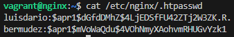
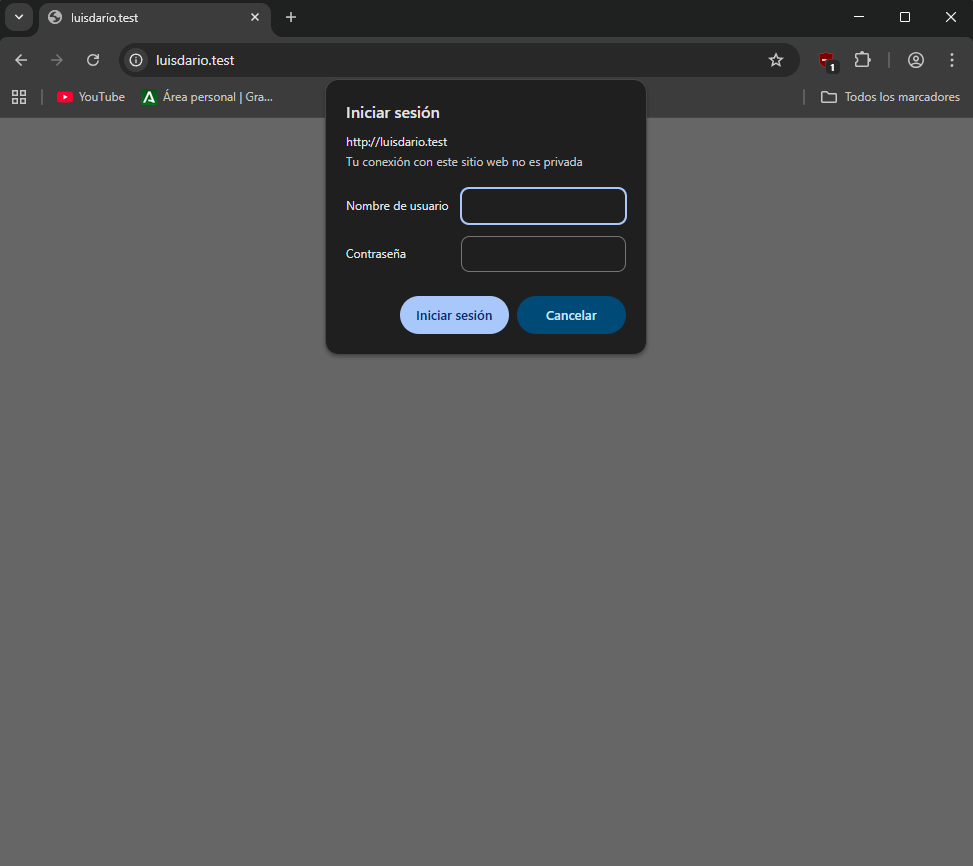
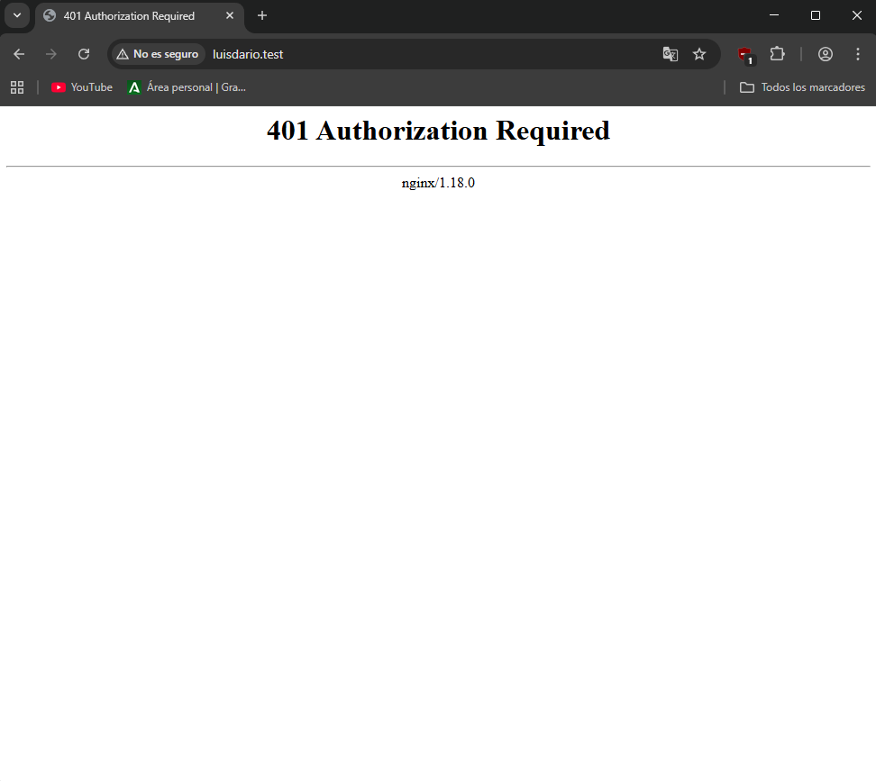
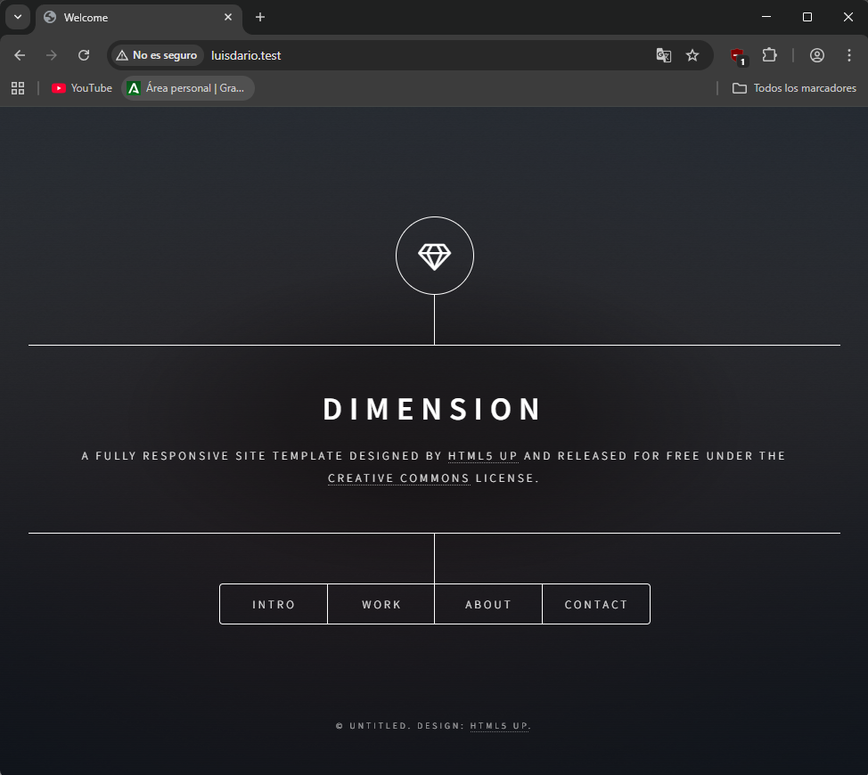
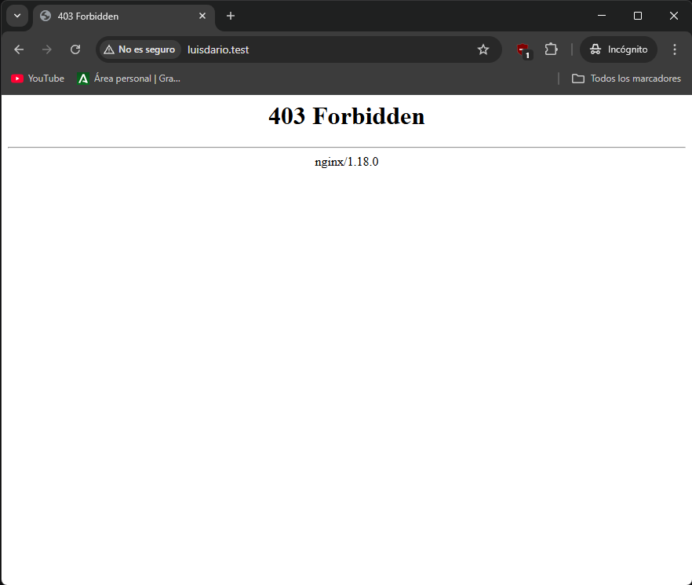
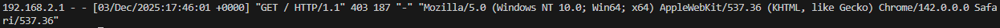

# Práctica 2.2: Autenticación en Nginx

## Sumario:

1.  Paquetes necesarios
2.  Creación de usuarios y contraseñas
3.  Configurando el servidor Nginx
4.  Comprobación
5.  Tareas \
    5.1. Tarea 1 \
    5.2. Tarea 2 \
    5.3. Combinación de la autenticación básica con la restricción de acceso por IP \
    5.4. Tarea 3 \
    5.5. Tarea 4

## 1. Paquetes necesarios

Vamos a empezar comprobando si tenemos las herramientas necesarias en nuestra máquina Debian. Para esta práctica utilizamos la herramienta `openssl` para crear las contraseñas. Comprobamos si el paquete está instalado con el siguiente comando:

```
dpkg -l | grep openssl
```

Si no lo estuviera, tendríamos que instalarlo.

## 2. Creación de usuarios y contraseñas

Ahora vamos a crear un archivo oculto llamado `.htpasswd` dentro del directorio de configuración `/etc/nginx` donde guardaremos los usuarios y contraseñas.

Ejecutamos el siguiente comando para crear el archivo y añadir el primer usuario (con mi nombre), teniendo cuidado de no olvidar los dos puntos después del nombre:

```
sudo sh -c "echo -n 'luisdario:' >> /etc/nginx/.htpasswd"
```

Hecho esto, vamos a crear la contraseña cifrada para este usuario de forma interactiva:

```
sudo sh -c "openssl passwd -apr1 >> /etc/nginx/.htpasswd"
```

Repetimos el proceso para crear un segundo usuario con mi primer apellido. Podemos comprobar con un `cat` que los usuarios y las contraseñas aparecen correctamente cifrados en el fichero:

```
cat /etc/nginx/.htpasswd
```

Nos tendría que salir algo así:



## 3. Configurando el servidor Nginx

Para configurar la autenticación básica, editaremos la configuración del server block sobre el cual queremos aplicar la restricción.

Ejecutamos `sudo nano /etc/nginx/sites-available/luisdario.test` y añadimos las directivas `auth_basic` y `auth_basic_user_file` dentro del `location /`:

```
server {
    listen 80;
    listen [::]:80;

    root /var/www/luisdario.test/html/static-website-example;
    index index.html index.htm index.nginx-debian.html;
    server_name luisdario.test;

    location / {
        auth_basic "Área restringida";
        auth_basic_user_file /etc/nginx/.htpasswd;
        try_files $uri $uri/ =404;
    }
}
```

Y reiniciamos el servidor para aplicar la configuración:

```
sudo systemctl restart nginx
```

## 4. Comprobación

Para verificar que funciona, accedemos desde nuestra máquina anfitriona a `http://luisdario.test`. Se nos debe solicitar autenticación, como se muestra en la siguiente captura:



Si decidimos cancelar la autenticación, se nos negará el acceso al sitio. El error que aparece es el "401 Authorization Required":



## 5. Tareas

### 5.1 Tarea 1

En esta tarea vamos a intentar entrar primero con un usuario erróneo y luego con uno correcto. Después, revisaremos los registros para ver los sucesos.

Podemos ver los logs con los siguientes comandos:

```
sudo cat /var/log/nginx/error.log
sudo cat /var/log/nginx/access.log
```

En la siguiente captura se ve el error de usuario inválido:



### 5.2 Tarea 2

Ahora vamos a aplicar la autenticación solo a una parte de la web. Primero borramos las dos líneas que hacen referencia a la autenticación básica en el `location` del directorio raíz.

Después, añadimos un nuevo `location` específico para el archivo `contact.html` con la autenticación activada:

```
    location / {
        try_files $uri $uri/ =404;
    }

    location /contact.html {
        auth_basic "Área de contacto";
        auth_basic_user_file /etc/nginx/.htpasswd;
    }
```

Reiniciamos nginx y comprobamos que la portada es accesible, pero al ir a Contacto nos pide clave:


### 5.3 Combinación de la autenticación básica con la restricción de acceso por IP

Podemos combinar la autenticación HTTP con la restricción por IP. Se pueden implementar dos escenarios:

- Que el usuario deba cumplir ambas cosas (IP válida y autenticado).
- Que el usuario deba cumplir al menos una de las dos.

Esto se gestiona con la directiva `satisfy`. Si la ponemos a `all`, se deben cumplir todas las condiciones; si es `any`, basta con una.

### 5.4 Tarea 3

Vamos a configurar Nginx para que no deje acceder con la IP de la máquina anfitriona al directorio raíz. Modificamos el archivo de configuración usando las directivas `allow` y `deny`:

```
    location / {
        deny 192.168.2.1;
        allow all;
        try_files $uri $uri/ =404;
    }
```

Al intentar entrar, vemos la página de error 403 Forbidden y podemos comprobar el mensaje correspondiente en el `error.log`:





### 5.5 Tarea 4

Por último, configuramos Nginx para que exija tanto una IP válida como un usuario válido (ambas a la vez) desde la máquina anfitriona.

Para ello usamos `satisfy all` junto con las directivas de IP y de autenticación:

```
    location / {
        satisfy all;

        allow 192.168.2.1;
        deny all;

        auth_basic_user_file /etc/nginx/.htpasswd;

        try_files $uri $uri/ =404;
    }
```
